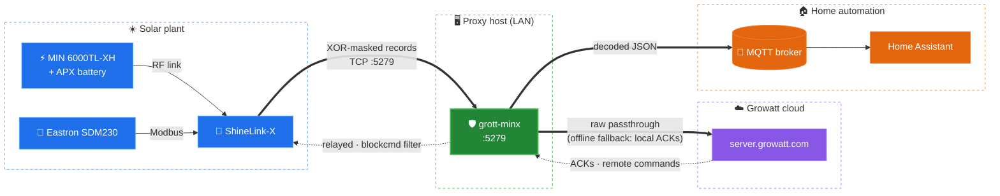

# grott-minx — Growatt inverter monitor (TCP proxy → MQTT)

Transparent TCP proxy that sits between a Growatt datalogger (ShineLink-X in this
setup; ShineWiFi/ShineLAN sticks speak the same protocol)
and `server.growatt.com`. All traffic is relayed byte-for-byte in both directions while
inverter and smart-meter records are decoded on the fly and published as JSON to an MQTT
broker (e.g. for Home Assistant) — no cloud polling, no official API, near-realtime data.



## Credits & scope

Based on [johanmeijer/grott](https://github.com/johanmeijer/grott) — all credit for the
original protocol reverse-engineering and record layouts goes to that project. This
repository is a heavily trimmed and hardened rewrite targeting one specific setup,
listed below with the exact firmware versions it is tested against — if you run this
same combination, everything here should work out of the box:

| Component | Model | Tested firmware / software |
|---|---|---|
| Inverter | Growatt MIN 6000TL-XH | `AL1.0` / `ALBA180701` / `ZABA-0023` |
| Battery | Growatt APX V1 | General controller BMS: monitoring `ZECA-11`, control `VDAA-11` — battery modules: BMS `QABA-11`, control `WAAA-11` |
| Datalogger | ShineLink-X | RF stick `7.4.1.4` — ShineLink-X `7.0.2.5` |
| Smart meter | Eastron SDM230 (Modbus) | Read through the Growatt datalogger (record types `20`/`1b`) |

Generic multi-inverter support, other operating modes and the unused record layouts
from upstream were deliberately removed. If your hardware differs, expect to bring
back the matching layout definitions from the original project.

> [!WARNING]
> Newer ShineWiFi firmware versions replace the XOR obfuscation with **AES-CBC
> encryption** of the record payload. The proxy approach in this repository is still
> feasible with those sticks, but it gets more involved: the AES layer (key/IV
> handling and decryption) must be implemented on top of the record framing. This is
> not covered here as-is — the ShineLink-X used in this setup still speaks the
> XOR-masked protocol described below.

## Design

The proxy is a single-threaded, non-blocking `select()` loop (`grottproxy.py`):

- **Passthrough is decoupled from parsing.** Every byte received is forwarded to the
  other side unconditionally; record decoding happens on an independent per-connection
  buffer. A record the parser cannot understand never disrupts the datalogger↔Growatt
  session.
- **Non-blocking sockets with per-socket send queues.** A slow or dead peer cannot
  stall the relay; stuck connections are dropped when their outbound queue exceeds
  `maxpending`.
- **TCP stream reassembly.** Records fragmented across TCP segments (or coalesced into
  one) are reassembled using the length field of the 8-byte record header.
- **TCP keepalive** on both legs detects half-open connections (NAT timeouts, power
  loss) instead of holding dead sockets forever.
- **Crash containment.** Record processing runs inside a guard; a malformed record is
  logged and skipped, the relay keeps running.

MQTT publishing (`grottdata.py`) uses a single persistent `paho-mqtt` client running in
a background daemon thread with automatic reconnection and exponential backoff. While
the broker is unreachable, `publish()` fails fast (bounded by `publishtimeout`) and the
proxy keeps relaying — an MQTT outage never blocks inverter traffic.

### Protocol notes

- Record header: 8 bytes — `seq(2) | protocol(2) | length(2) | deviceno(1) | rectype(1)`.
  Total record size is `length + 8` (protocols `05`/`06`, CRC16-Modbus suffix) or
  `length + 6` (protocols `00`/`02`).
- Protocol `05`/`06` payloads are XOR-obfuscated with the rolling mask `"Growatt"`
  (header excluded).
- Protocol `05`/`06` records carry a CRC16-Modbus trailer: records failing the check
  are still relayed to Growatt but skipped for decoding/publishing.
- Field offsets per record layout are defined in `grott.py` (`T06NNNNXMIN` for
  MIN-series inverters, `T06NN20` for smart meters).
- Published `values` are raw register integers; scaling factors (`divide`) are part of
  the layout definitions.

### Record types

The record type is the last header byte (`rectype`). Meanings were
reverse-engineered by the upstream [grott](https://github.com/johanmeijer/grott)
project (see its `grottserver.py`); this is how each type is handled here:

| Type | Direction | Meaning | Handling by this proxy |
|---|---|---|---|
| `03` | logger → cloud | Announce/registration at session start: carries datalogger and inverter serials | Relayed; ACKed locally in local/fallback modes |
| `04` | logger → cloud | **Live inverter data** (the main metrics payload) | Relayed, decoded and published to MQTT |
| `50` | logger → cloud | Buffered (historical) inverter data, sent after connectivity gaps | Relayed; published only if `sendbuf = True` |
| `20` / `1b` | logger → cloud | Smart meter data records | Relayed, decoded and published to MQTT |
| `16` | logger → cloud | Ping / keepalive | Relayed; in local/fallback modes echoed back verbatim |
| `29` | logger → cloud | Auxiliary record for which the real server sends **no response** | Relayed; never ACKed in local modes |
| `05` | cloud → inverter | **Read inverter holding register** | Dropped by `blockcmd` |
| `06` | cloud → inverter | **Write inverter holding register** (remote configuration) | Dropped by `blockcmd` |
| `10` | cloud → inverter | **Multi-register write** (bulk configuration) | Dropped by `blockcmd` |
| `18` | cloud → logger | **Write datalogger register** — e.g. reg `31`/`0x1f` clock sync, reg `17`/`0x11` server IP, upload interval | Dropped by `blockcmd` |
| `19` | cloud → logger | **Read datalogger register** | Dropped by `blockcmd` |

Notes:

- Responses to `05/06/10/18/19` commands travel logger → cloud with the same record
  type. `blockcmd` only filters the cloud → logger direction, so responses are never
  affected — and a dropped command simply never gets one.
- With `blockcmd = True` the server's periodic clock sync (a type `18` write to
  register 31) is blocked too, so the datalogger clock may drift. This is irrelevant
  with `time = server` (records are timestamped at arrival). The upstream project
  whitelists that specific write; this fork deliberately keeps the filter simple and
  strict.

## Repository layout

| File | Responsibility |
|---|---|
| `grott.py` | Configuration (`GrottConf`, record layouts), logging setup, entry point |
| `grottproxy.py` | Non-blocking TCP relay + record framing |
| `grottdata.py` | Record decryption/decoding, MQTT publisher (persistent client) |
| `grott.ini` | Runtime configuration (see below) |
| `pyproject.toml` / `uv.lock` | Project + pinned dependencies (managed with [uv](https://docs.astral.sh/uv/)) |

## Requirements

- Linux (the code is intentionally Linux-only: `SIGPIPE`, `TCP_KEEPIDLE/INTVL/CNT`)
- Python ≥ 3.14 — deployed on CPython 3.14 **free-threaded** (`.python-version` = `3.14t`)
- `paho-mqtt` ≥ 1.6 (pinned to 2.x in `uv.lock`; both callback APIs supported)

## Quick start

```sh
uv sync                     # creates .venv from uv.lock (installs 3.14t if missing)
cp grott.ini.example grott.ini   # then fill in Growatt/MQTT settings
uv run grott.py             # runs in foreground, reads ./grott.ini
```

Point the datalogger at the proxy host, port `5279` (via the Growatt local config
portal or `ShinePhone` → datalogger settings). The proxy forwards to the real Growatt
server configured in `[Growatt]`.

## Configuration (`grott.ini`)

| Section / key | Default | Purpose |
|---|---|---|
| `[Generic] loglevel` | `INFO` | Root log level (`DEBUG` enables hex dumps) |
| `[Generic] minrecl` | `100` | Minimum record size (bytes) worth decoding |
| `[Generic] time` | `server` | `server`: timestamp records at arrival time |
| `[Generic] sendbuf` | `False` | Publish buffered (type `50`) records to MQTT |
| `[Generic] includeall` | `True` | Include fields marked `incl: no` in layouts |
| `[Generic] blockcmd` | `False` | Drop remote register commands (types `05/06/10/18/19`) server → datalogger |
| `[Growatt] ip / port` | `47.254.130.145 / 5279` | Upstream Growatt server |
| `[Growatt] noforward` | `False` | Local-only mode: never contact Growatt, the proxy ACKs records itself |
| `[Growatt] fallback` | `True` | Serve the datalogger locally while Growatt is unreachable (MQTT keeps flowing) |
| `[Growatt] fallbackretry` | `300` | Seconds between attempts to restore the Growatt connection |
| `[Proxy] buffersize` | `4096` | `recv()` chunk size |
| `[Proxy] selecttimeout` | `1.0` | Max `select()` blocking time (s) |
| `[Proxy] connecttimeout` | `10.0` | Connect timeout towards Growatt (s) |
| `[Proxy] maxpending / maxparsebuf` | `1 MiB` | Outbound queue / parse buffer caps |
| `[Proxy] backlog` | `200` | Listen backlog |
| `[Proxy] tcpkeepidle / tcpkeepintvl / tcpkeepcnt` | `60 / 10 / 3` | TCP keepalive tuning |
| `[MQTT] ip / port / topic / user / password` | — | Broker connection and topic |
| `[MQTT] retain / nomqtt` | `False` | Retain flag / disable publishing |
| `[MQTT] keepalive` | `60` | MQTT keepalive (s) |
| `[MQTT] publishtimeout` | `2.0` | Max wait per publish before dropping (s) |
| `[MQTT] reconnectmindelay / reconnectmaxdelay` | `1 / 30` | Reconnect backoff bounds (s) |

Protocol-structural values (header offsets, XOR mask, CRC, record layouts) are code,
not configuration.

### Command blocking and local-only mode

- **`[Generic] blockcmd = True`** keeps cloud monitoring but prevents remote
  reconfiguration: register read/write records (types `05`, `06`, `10`, `18`, `19`,
  see [Record types](#record-types)) sent by the Growatt server towards the
  datalogger are dropped, while ACKs and data records flow normally. In this mode
  the server→datalogger direction is forwarded per validated record; if that stream
  ever becomes unparseable it falls back to raw forwarding (fail open, availability
  first).
- **`[Growatt] noforward = True`** runs fully offline: the proxy never contacts
  Growatt and acknowledges every CRC-valid record itself (pings are echoed back,
  everything else gets the standard short ACK), so the datalogger keeps streaming
  while data goes to MQTT only. Trade-offs: no cloud/ShinePhone monitoring and the
  datalogger clock is never re-synced by the server (records are timestamped at
  arrival with `time = server`).
- **Offline fallback (`[Growatt] fallback = True`, default):** if the Growatt server
  is unreachable (internet outage, cloud downtime), incoming datalogger connections
  are automatically served in the same local-ACK mode, so **MQTT keeps receiving
  data during the outage**. Every `fallbackretry` seconds the fallback session is
  recycled to re-attempt the cloud connection (the datalogger reconnects within
  seconds and unacknowledged records are retried). Trade-off: records acknowledged
  locally during an outage are considered delivered by the datalogger and will not
  be backfilled to the Growatt cloud. Set `fallback = False` to restore the strict
  behaviour (refuse connections, datalogger buffers for the cloud, no local data
  during outages).

### Published payload

```json
{
  "device": "MIN1234567",
  "time": "2026-08-14T12:34:56",
  "buffered": "no",
  "values": { "pvstatus": 1, "pvpowerin": 12345, "pv1voltage": 2381, "...": 0 }
}
```

## Deployment

### OpenRC (Alpine / Gentoo) — as deployed here

This setup runs on **Alpine Linux**, whose init system is OpenRC. Production runs as
an OpenRC service (`/etc/init.d/grott`) supervised by `supervise-daemon` —
ready-to-use templates are in [`deploy/`](deploy/) (`grott.openrc`,
`grott.logrotate`):

- `command=<repo>/.venv/bin/python grott.py`, `directory=<repo>`
- **Respawn**: automatic restart 5 s after a crash
- **Health check**: every 60 s the supervisor verifies the listen port is still open
  (`netstat`, port read from `grott.ini`, fallback `5279`) and restarts the process if
  not — covers hangs, not just crashes
- stdout/stderr → `/var/log/grott.log`, rotated by logrotate
  (`copytruncate`, 10 MB × 5, `/etc/logrotate.d/grott`)

```sh
rc-service grott start|stop|restart|status
rc-update add grott default        # start on boot
tail -f /var/log/grott.log
```

No cron-based restarts are needed: supervision covers crashes and the health check
covers hangs.

### systemd (Debian, Ubuntu, Raspberry Pi OS, …)

OpenRC is not available (in practice) on systemd-based distros. Use the unit template
in [`deploy/grott.service`](deploy/grott.service) instead: `Restart=always` +
`RestartSec=5` gives the same crash-respawn behaviour, and stdout/stderr go to the
journal (`journalctl -u grott`), so no logrotate config is needed. The OpenRC port
health check has no built-in systemd equivalent; replicate it with a systemd timer
that probes the port and restarts the unit, or rely on the relay's own hang
protections (non-blocking I/O + TCP keepalive).

## Home Assistant integration

[`examples/growatt.yaml.example`](examples/growatt.yaml.example) provides a ready-made
set of MQTT sensor definitions covering the inverter, the APX battery (BDC/BMS
entities) and the Eastron SDM230 smart meter, mapping the raw `values` payload to
scaled Home Assistant entities.

1. Copy it to your Home Assistant configuration as `mqtt_sensors/growatt.yaml`.
2. Replace the `<INVERTER_SERIAL>` and `<DATALOGGER_SERIAL>` placeholders with your
   serials (visible as the `device` field of the published MQTT payload).
3. Include the folder from `configuration.yaml`:

   ```yaml
   mqtt:
     sensor: !include_dir_merge_list mqtt_sensors
   ```

Most sensors use `expire_after: 120`, so entities become `unavailable` when the
inverter stops reporting (e.g. overnight).

## Development

```sh
uvx ruff check *.py                    # lint (rules & documented ignores in pyproject.toml)
uv run --with pylint pylint *.py       # pylint (config in pyproject.toml)
uv run python tests/test_smoke.py      # end-to-end smoke test (fake datalogger, Growatt server and MQTT broker)
uv lock --upgrade-package paho-mqtt && uv sync && uv export --no-hashes -o requirements.txt
```

CI (GitHub Actions) runs ruff, pylint and the smoke test on every push/PR.

Note: `grott.py` starts the proxy at import time — never import it from tests; drive
`Proxy`/`procdata` directly with a stub `conf` object (see `grottproxy.Proxy.__init__`
for the attributes it expects).
